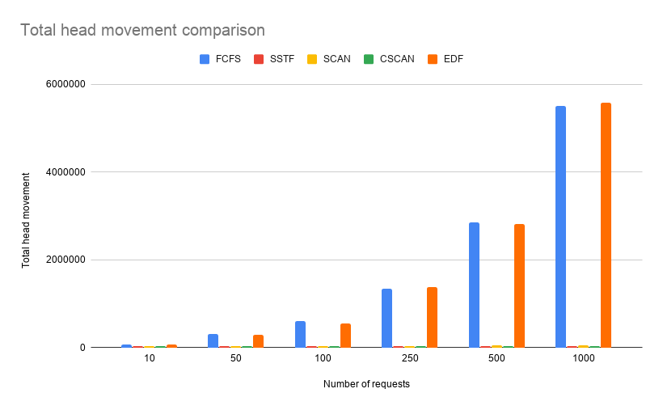
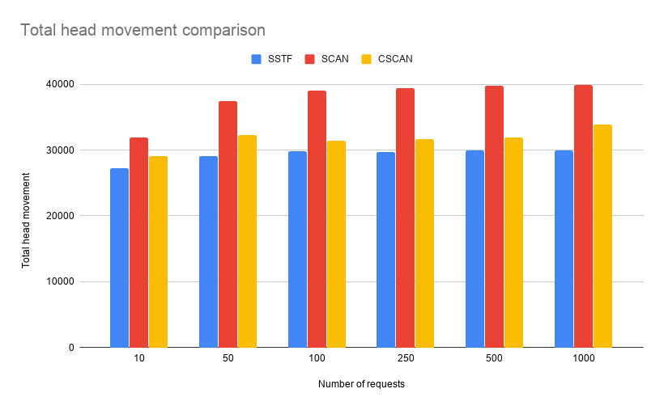

# Operating Systems - Disk Scheduling Algorithms

11th of June 2020\
Łukasz Blachnicki **254597**

# The content of the task

Disk scheduling algorithms - simulation of algorithms FCFS, SSTF, SCAN, C-SCAN, EDF, FD-SCAN. 

Compare their execution time (estimated by the total movement of disk head).

# Solution

The main class is a **Disk** class, containing the scheduling algorithm.

I am counting the total movements of the disk head to compare the performance of the algorithms.

Additionally, I spread about 80% of the processors randomly around the whole disk, and then allocate the remaining 20% in a narrower position "window". The reason for that is I assume that sometimes the processors for reading/writing are nearby each other.

The disk size is set to 20000 units.

# Comparison of performance

Due to large number of head movement for FCFS and EDF, below is the chart without them.

The total head movement for each algorithm was calculated five times and the chart uses the arithmetic average.

### The performance data used in the charts:

|     | Number of processors | FCFS      | SSTF    | SCAN    | CSCAN   | EDF       |
| --- | ------------------ | --------- | ------- | ------- | ------- | --------- |
|     | 10                 | 54519     | 28015   | 30537   | 30537   | 55773     |
|     | 10                 | 77084     | 25198   | 30636   | 25198   | 58834     |
|     | 10                 | 30913     | 29205   | 34205   | 29016   | 64474     |
|     | 10                 | 77128     | 24191   | 27650   | 24191   | 67013     |
|     | 10                 | 78769     | 29305   | 36389   | 36389   | 70487     |
| AVG | 10                 | 63682.6   | 27182.8 | 31883.4 | 29066.2 | 63316.2   |
|     | 50                 | 220727    | 27841   | 35533   | 27253   | 219856    |
|     | 50                 | 335381    | 29722   | 39095   | 39095   | 310454    |
|     | 50                 | 347248    | 28825   | 37124   | 28825   | 322789    |
|     | 50                 | 310364    | 29084   | 37136   | 37136   | 295510    |
|     | 50                 | 326050    | 29746   | 38569   | 29368   | 306013    |
| AVG | 50                 | 307954    | 29043.6 | 37491.4 | 32335.4 | 290924.4  |
|     | 100                | 554712    | 31394   | 39518   | 29857   | 515393    |
|     | 100                | 640353    | 29934   | 39720   | 29840   | 576499    |
|     | 100                | 608526    | 29211   | 38293   | 29211   | 555092    |
|     | 100                | 555600    | 29523   | 38786   | 38786   | 550542    |
|     | 100                | 608951    | 29337   | 38618   | 29337   | 578853    |
| AVG | 100                | 593628.4  | 29879.8 | 38987   | 31406.2 | 555275.8  |
|     | 250                | 1396240   | 29847   | 39544   | 29847   | 1395407   |
|     | 250                | 1301748   | 29756   | 39527   | 29756   | 1352511   |
|     | 250                | 1264019   | 29784   | 39395   | 39395   | 1357629   |
|     | 250                | 1408393   | 29340   | 38997   | 29485   | 1370693   |
|     | 250                | 1353508   | 29699   | 39372   | 29647   | 1374164   |
| AVG | 250                | 1344781.6 | 29685.2 | 39367   | 31626   | 1370080.8 |
|     | 500                | 2890805   | 29933   | 39753   | 29933   | 2873290   |
|     | 500                | 2762704   | 29942   | 39829   | 29942   | 2846173   |
|     | 500                | 2912587   | 29871   | 39787   | 29891   | 2804770   |
|     | 500                | 2997123   | 29881   | 39766   | 39766   | 2830533   |
|     | 500                | 2663369   | 29821   | 39781   | 29895   | 2732629   |
| AVG | 500                | 2845317.6 | 29889.6 | 39783.2 | 31885.4 | 2817479   |
|     | 1000               | 5400094   | 29782   | 39753   | 39753   | 5511839   |
|     | 1000               | 5805084   | 29803   | 39736   | 39736   | 5561115   |
|     | 1000               | 5416189   | 29965   | 39843   | 29965   | 5548575   |
|     | 1000               | 5265029   | 30004   | 39964   | 29989   | 5630692   |
|     | 1000               | 5640634   | 29977   | 39919   | 29977   | 5656636   |
| AVG | 1000               | 5505406   | 29906.2 | 39843   | 33884   | 5581771.4 |

# Conclusions

#### FCFS
Judging by the obtained data, it's the least efficient algorithm out of the five.

#### SSTF
Surprisingly, this algorithm proved to be the most efficient for my data. The reason is that the processor positions are generating randomly. They are distributed uniformly enough so that the head doesn't need to make huge "jumps".

#### SCAN
Similarly to the above. It's the least efficient out of SSTF, SCAN and C-SCAN most likely due to uniform distribution of processor positions.

#### C-SCAN
We can observe that the head movements count doesn't increase linearly as opposed to the other algorithms, thus it's probably the most efficient one.

#### EDF
Measurement of total head movements and comparing it to other algorithms doesn't really tell us much, since this is the only algorithm (in the assignment) that takes processor deadlines into account. They are assigned randomly in the program, thus the head movement count is very similar to FCFS. 