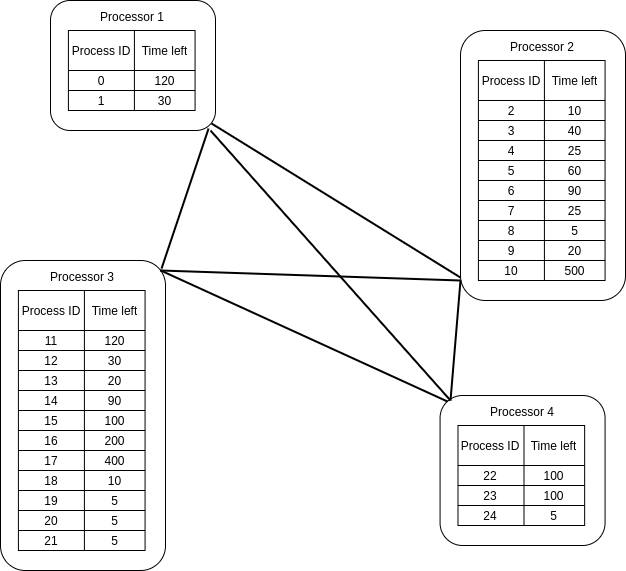

# Operating Systems - Processor scheduling in distributed systems

13th of June 2020\
Łukasz Blachnicki **254597**

# The content of the task

Processor scheduling in distributed systems (processor assignment for a process) - simulation of algorithms: random, maximum threshold, minimum threshold.

Compare CPU load, number of requests sent, number of process migrations.

# Solution

I have decided to represent the distributed distributedSystem as a undirected graph of processors:

The algorithms are running a loop until every process is resolved.

In every processor the processes are resolved using ROT algorithm.

# Comparison of performance

### The measurements used in the charts:

# Conclusions
