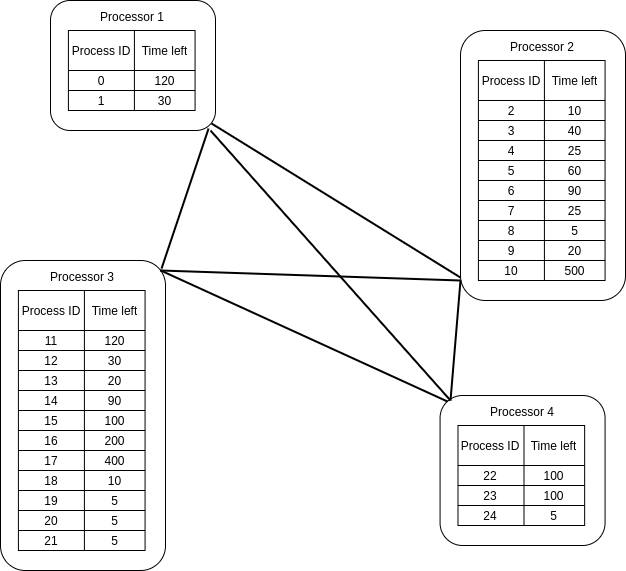
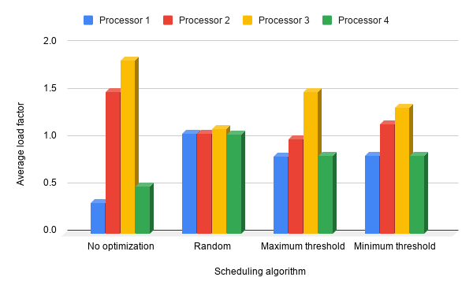
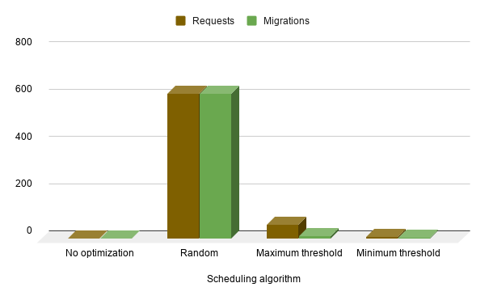

# Operating Systems - Processor scheduling in distributed systems

13th of June 2020\
Łukasz Blachnicki **254597**

# The content of the task

Processor scheduling in distributed systems (processor assignment for a process) - simulation of algorithms: random, maximum threshold, minimum threshold.

Compare CPU load, number of requests sent, number of process migrations.

# Solution

I have decided to represent the distributed system as a pre-filled undirected graph of processors:

The algorithms are running a loop until every process is resolved. 6 processes are a hard-coded "capacity" of every processor and are equivalent to 100% load.

In every processor the processes are resolved using ROT algorithm.

# Comparison of performance

### The measurements used in the charts:

|                   | Processor 1 avg. load | Processor 2 avg. load | Processor 3 avg. load | Processor 4 avg. load | Requests | Migrations |
| ----------------- | --------------------- | --------------------- | --------------------- | --------------------- | -------- | ---------- |
| No optimization   | 0.33                  | 1.5                   | 1.83                  | 0.5                   | 0        | 0          |
| Random            | 1.06                  | 1.06                  | 1.11                  | 1.05                  | 614      | 614        |
| Maximum threshold | 0.82                  | 1                     | 1.5                   | 0.83                  | 60       | 12         |
| Minimum threshold | 0.83                  | 1.16                  | 1.33                  | 0.83                  | 10       | 5          |

# Conclusions

I've included "No optimization" case in the solution, which is actually no scheduling, where the processes are not being moved between the processors at all.

In the example data we can observe that the processors **2** and **3** are under heavy load from the very beginning.

#### Random algorithm

I assumed that migrating a process takes some time, so despite creating an almost perfect load balance, running this algorithm required lots of migrations, making it not very efficient.

#### Maximum threshold algorithm

This algorithm spread the load between the processor pretty well, while keeping the number of migrations at 12.

#### Minimum threshold algorithm

We can observe that in this approach the processors **2** and **3** are still under some heavy load. Their work was split with the others, but just to some limited extent. I consider this a tradeoff, since in this algorithm I have achieved the lowest number of migrations - 5.
