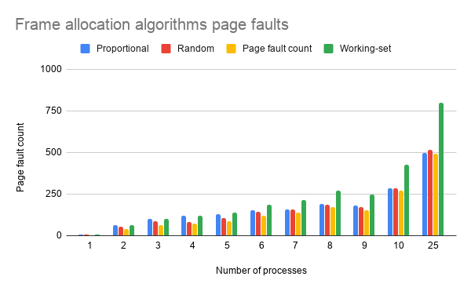

# Operating Systems - Frame Allocation Algorithms

13th of June 2020\
Łukasz Blachnicki **254597**

# The content of the task

Frame allocation algorithms for multiple processes - simulation of algorithms: random, proportional, processor fault frequency, working set.

Compare their numbers of generated processor faults.

# Solution

I'm generating random amount of processes with random size and random processors.

The size of the distributedSystem is hard-coded to 128 units.

The minimum size of a process is 2 units.

# Comparison of performance

### The measurements used in the charts:

| Process count | Proportional | Random | Page fault count | Working-set |
| :-----------: | :----------: | :----: | :--------------: | :---------: |
|       1       |      5       |   5    |        3         |      5      |
|       2       |      64      |   52   |        42        |     64      |
|       3       |     102      |   89   |        64        |     102     |
|       4       |     120      |   84   |        71        |     120     |
|       5       |     128      |  106   |        89        |     140     |
|       6       |     151      |  144   |       120        |     184     |
|       7       |     160      |  158   |       139        |     213     |
|       8       |     190      |  188   |       174        |     273     |
|       9       |     179      |  174   |       154        |     245     |
|      10       |     287      |  287   |       271        |     425     |
|      25       |     498      |  515   |       492        |     801     |

# Conclusions

### Proportional & working-set

These two perform the worst.

I expected the latter to be the most performant, but probably due to random generation of the data it works very similarly to the proportional algorithm (working-set utilizes the properties of locality which I do not generate in my code).

### Random

For a small number of processes this algorithm works better than the proportional and can be considered as a replacement for more complicated algorithms.

### Page fault count

I observed that this algorithm works the best in case of random data.
