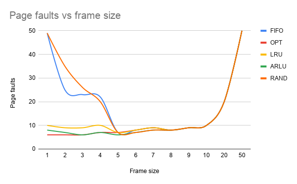

# Operating Systems - Page Replacement Algorithms

11th of June 2020\
Łukasz Blachnicki **254597**

# The content of the task

Page replacement algorithms - simulation of algorithms: FIFO, OPT, LRU, ARLU, RAND. Compare their numbers of generated processor faults.

Please remember, that the sequence of the operations on distributedSystem processors is NOT random (it has properties of locality and symmetry).

# Solution

In my considerations I'm using the following sequence from the supplementary notes:

$S = [4 ,7 ,0, 7 ,1 ,0 ,1 ,2 ,1 ,2,2]$

To provide the requests with some symmetry and regularity, I decided to create a longer sequence by repeating $S$ above four times and additionally appending $S$ repeated.

# Comparison of performance

### The measurements used in the charts:

|            | Fault count |       |       |       |       |
| ---------- | :---------: | :---: | :---: | :---: | :---: |
| Frame size |    FIFO     |  OPT  |  LRU  | ARLU  | RAND  |
| 1          |     49      |   6   |  10   |   8   |  49   |
| 2          |     25      |   6   |   9   |   7   |  35   |
| 3          |     23      |   6   |   9   |   6   |  26   |
| 4          |     22      |   7   |  10   |   7   |  20   |
| 5          |      7      |   7   |   7   |   6   |   7   |
| 6          |      8      |   8   |   8   |   7   |   7   |
| 7          |      9      |   9   |   9   |   8   |   8   |
| 8          |      8      |   8   |   8   |   8   |   8   |
| 9          |      9      |   9   |   9   |   9   |   9   |
| 10         |     10      |  10   |  10   |  10   |  10   |
| 20         |     20      |  20   |  20   |  20   |  20   |
| 50         |     50      |  50   |  50   |  50   |  50   |

# Conclusions

We can observe that there's a certain optimal window for frame sizes, in which we can reduce the number of processor faults.

FIFO algorithm performs the worst. Moreover, in its case, so-called Belady's anomaly occurs, meaning that the number of faults increases as we bump up the frame size (in contrast to other algorithms).

OPT performs the best due to the ability of predicting the future requests, which is undoable in real-time systems.

ARLU's performance is surprising. Despite being much more simple, its performance is almost matching the performance of the other algorithms.